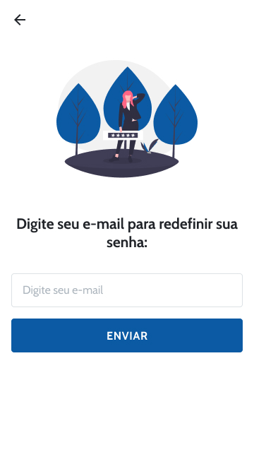
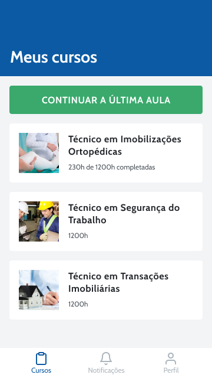
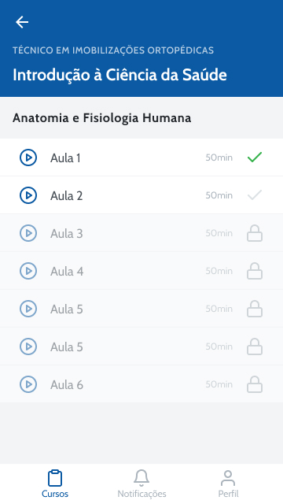
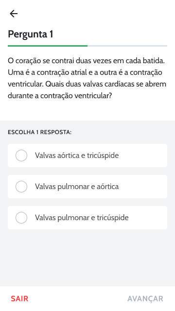
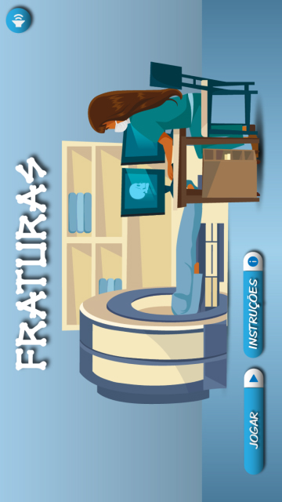
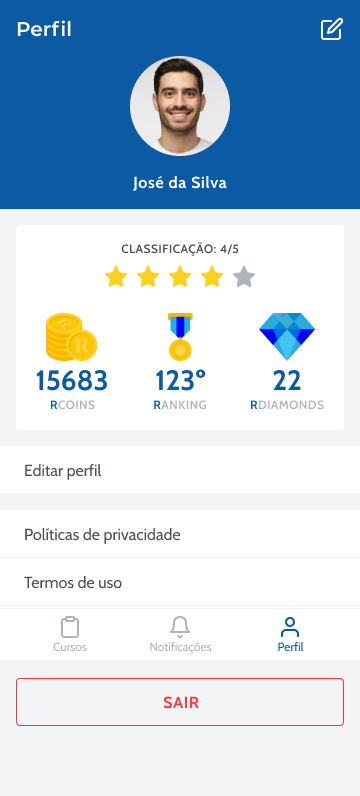
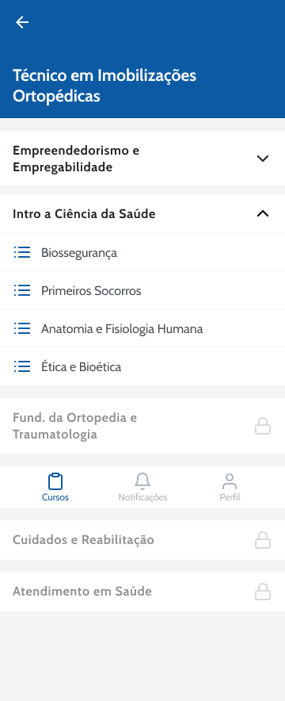
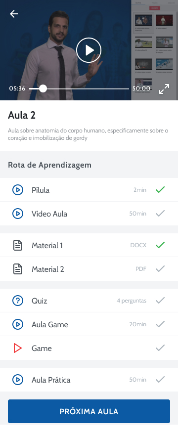
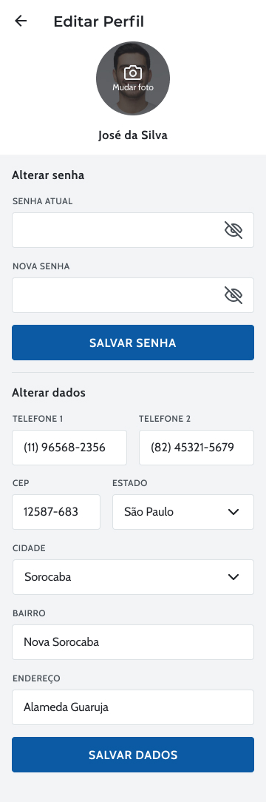

<h4 align="center">
	📱 E-Learning App
</h4>

<p align="center">
 <a href="#-about">About</a> •
 <a href="#features">Features</a> •
 <a href="#-layout">Layout</a> •
 <a href="#-how-it-works">How it works</a> •
 <a href="#-tech-stack">Tech Stack</a> •
 <a href="#author">Authors</a> •
 <a href="#-license">License</a> •
 <a href="#versions-of-readme">Version Portuguese(BR)</a>
</p>

## 💻 About

📱 Esse aplicativo é uma forma das escolas oferecerem todo seu potencial educacional no smartphone com videoaulas, quiz, gamificação e pontuação integrada.

Esse projeto foi uma proposta de aplicativo para o atual sistema da empresa Residência Educação.

A Residência Educação é uma escola técnica que atua em todo o território brasileiro, trazendo diversas soluções tecnológicas que ajudam a democratizar o acesso ao ensino profissionalizante no país.

### 💡 Esse projeto é apenas um protótipo, o projeto que foi para produção é um github privado 😎.

## ⚙️ Features

- [x] Login screen
- [x] Register screen
- [x] Forgot password screen
- [x] My courses screen
  - [x] Connection with API to list your courses
- [x] Course content listing screen
  - [x] Subjects
  - [x] Modules
- [x] Classroom screen:
  - [x] Learning route - Video lesson - Quiz - Game
  - [x] Quiz screen
  - Game
- [x] User profile screen
  - [x] User edit profile screen
  - Bonus for use
- [x] Notifações

---

## 🎨 Layout

The application layout is available on Figma:

<a href="https://www.figma.com/file/F26McY0HQdRHGQq7q7tqAxid/App-Residencia?node-id=14%3A72">
  
</a>

### Mobile

<p align="center">
  

  

  

  

  

  

  
</p>

<p align="center">

  

  

  

</p>

---

## 🚀 How it works

💡
Install the nodejs version less than or equal to 12.9, higher versions may have an error when running on the android emulator.

### Pre-requisites

Before you begin, you will need to have the following tools installed on your machine:
[Git](https://git-scm.com), [Node.js](https://nodejs.org/en/), [React-Native](https://https://reactnative.dev/)
In addition, it is good to have an editor to work with the code like [VSCode](https://code.visualstudio.com/)

#### 🧭 Rodando a aplicação

```bash

# Clone this repository
$ git clone https://github.com/geanfeltrin/e-learning-app.git

# Access the project folder cmd/terminal
$ cd e-learning-app

# Install the dependencies
$ yarn

# Open the emulator of your choice


# Run the application in development mode
$ react-native run-android or react-native run-ios

# The application will open in emulator of your choice

```

---

## 🛠 Tech Stack

The following tools were used in the construction of the project:

#### **Mobile** ([React-native])(https://https://reactnative.dev/)

- **[React Navigation](https://reactnavigation.org/)**
- **[Styled-Components](https://styled-components.com/)**
- **[Axios](https://github.com/axios/axios)**
- **[React Redux](https://react-redux.js.org/)**
- **[Redux Saga](https://redux-saga.js.org/)**
- **[React Native Youtube Sdk](https://github.com/up-inside/react-native-youtube-sdk)**

## 🦸 Authors

<a href="https://github.com/geanfeltrin">
 
 <br />
  <sub>
    <b>Gean Feltrin - Web Developer</b>
  </sub>
</a>
 <br />

[](https://twitter.com/Geanfeltrin1) [](https://www.linkedin.com/in/geanfeltrin/)
[](mailto:geanfeltrin75@gmail.com)

<a href="https://www.behance.net/emanuelbarreto">
 
 <br />
 <sub><b>Emanuel Barreto - Designer</b></sub></a>
<br />

[](https://www.linkedin.com/in/emanuelbarreto/)
[](mailto:emanueelb@gmail.com)

---

## 📝 License

This project is under the license [MIT](./LICENSE).

Made with love by Gean Feltrin 👋🏽 [Entre em contato!](https://www.linkedin.com/in/geanfeltrin/)

---

## Versions of README

[Portuguese 🇧🇷](./README-PT.md) | [English 🇺🇸](./README.md)
